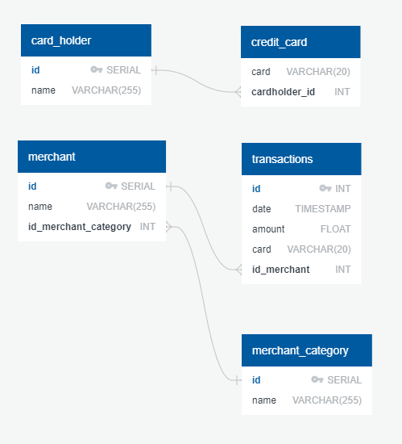

# sql-homework
Module 7 challenge: Looking for Suspicious Transactions

## Data Modeling
#### Entity relationship diagram

## Data Engineering
#### Database schema
[schema.sql](Data/schema.sql)

## Data Analysis
### Part 1
#### Task: How can you isolate (or group) the transactions of each cardholder?
*Note: In speaking with AskBCS, it was clarified that I should be grouping transactions per card, not cardholder.*
See query \#1 in [queries.sql](Data/queries.sql).

#### Task: Count the transactions that are less than $2.00 per cardholder.
*Note: In speaking with AskBCS, it was clarified that I should be listing the transactions that are less than $2.00 per card, not counting the transactions that are less than $2.00 per cardholder. I have performed two queries: Listed all transactions under $2.00 per card; counted all transactions under $2.00 per card.*
See queries \#2a and \#2b in [queries.sql](Data/queries.sql).

#### Task: Is there any evidence to suggest that a credit card has been hacked? Explain your rationale.
Looking at transaction totals, the vast majority of the 53 credit cards were subject to less than ten (10) transactions under $2.00; only six (6) of the credit cards were subject to ten (10) or more transactions under $2.00. There were also nine (9) credit cards that were subject to nine (9) transactions under $2.00. Looking at individual transactions, while most credit cards saw the transactions spread out over the course of the year, some saw multiple transactions posted in the same month. Some credit cards also witnessed multiple transactions from the same merchant.

#### Task: What are the top 100 highest transactions made between 7:00 am and 9:00 am?
*Note: In speaking with AskBCS, it was clarified that I should be listing the 100 highest-priced (largest) transactions under $2.00 made between 7:00 am and 9:00 am. The example code AskBCS provided, however, acquired data for 7 am through to the end of the 9 am hour (i.e. up to, but not including, 10 am). I have only acquired data up to, but not including, 9 am, as the instructions request.*
See query \#3 in [queries.sql](Data/queries.sql).

#### Task: Do you see any anomalous transactions that could be fraudulent?
The answer to this question depends on what your criteria is for "anomalous". There are some transaction amounts that are duplicated, though they are across different credit cards and different merchants. There are also a number of transactions under $1 which raise suspicion as there aren't many daily-use items that cost less than $1.

#### Task: Is there a higher number of fraudulent transactions made during this time frame versus the rest of the day?
Per query \#4 in [queries.sql](Data/queries.sql):
Again, the answer to this questions depends on what your criteria is for determining a fraudulent transaction. There were 30 transactions under $2.00 that were made between 7 am and 10 am, whereas the rest of the day saw a total of 320 transactions under $2.00. Between 7 am and 9 am, the average number of transactions per hour is 15; for the remainder of the day, that average is 14.5.

#### Task: If you answered yes to the previous question, explain why you think there might be fraudulent transactions during this time frame.
While I can not determine an answer to the previous question, I could surmise that fraudulent transactions under $2.00 are most likely to be made between 7 am and 9 am as that is the timeframe in which most people are stopping for coffee on their way to work, so it would be easiest to hide small transactions.

#### Task: What are the top 5 merchants prone to being hacked using small transactions?
Per query \#5 in [queries.sql](Data/queries.sql):
1. Wood-Ramirez
2. Baker Inc
3. Hood-Phillips
4. Martinez Group
5. Reed Group

### Part 2
#### Task: What difference do you observe between the consumption patterns? Does the difference suggest a fraudulent transaction? Explain your rationale.
The transactions for cardholder 18 show a number of large-value purchases. Depending on the position held by cardholder 18, these large purchases may be fraudulent.

#### Task: Are there any outliers for cardholder ID 25? How many outliers are there per month?
The month of February saw no outliers. The months of January, March and May each saw one outlier. The months of April and June each saw three outliers.

#### Task: Do you notice any anomalies? Describe your observations and conclusions.
Six of the outliers described above are over $1,000; the other three outliers are under $1,000. As the CEO of the biggest customer suspects there may be unauthorized usage in the first quarter of 2018, the outliers in January and March may prove the CEO's suspicion.
